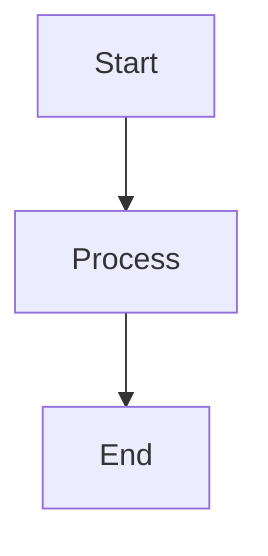
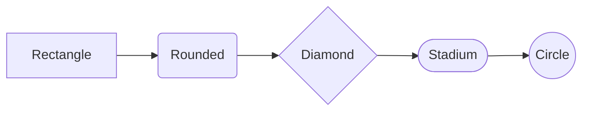
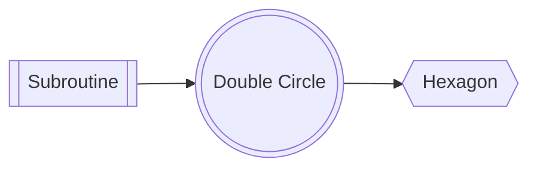
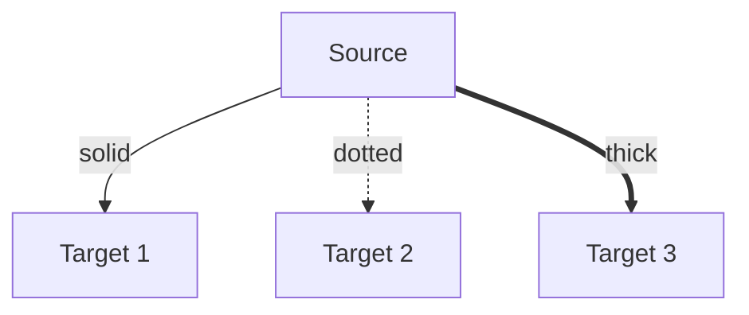
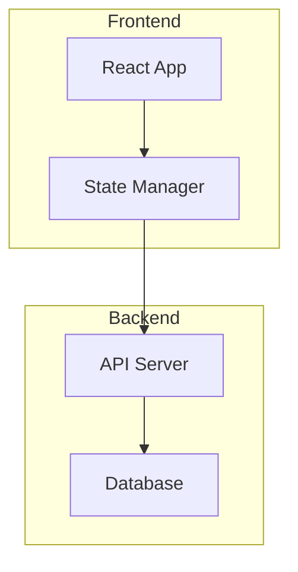
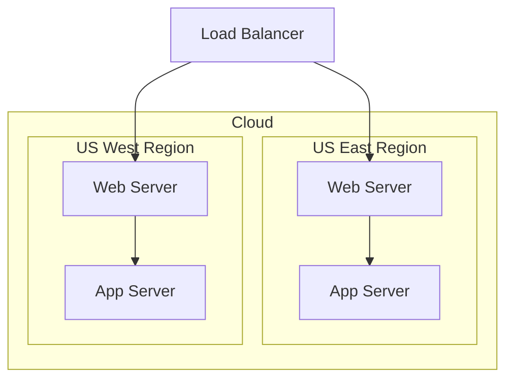
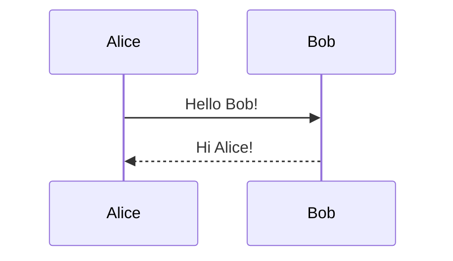
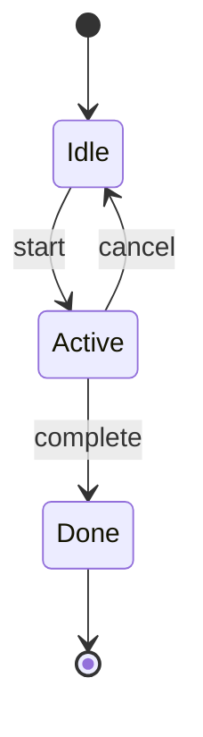
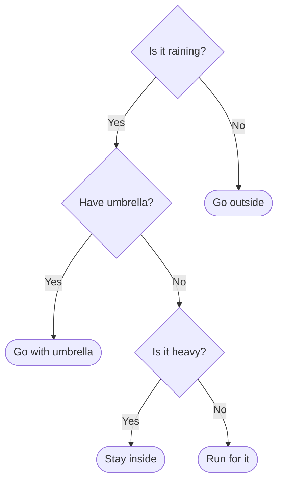

# Mermaid Samples (Beautiful Mermaid)

This file contains multiple Mermaid examples based on https://agents.craft.do/mermaid.

## Simple Flow

## Node Shapes

## Batch Shapes

## Edge Styles

## Subgraphs

## Nested Subgraphs

## Sequence: Basic Messages

## State Diagram: Basic

## Decision Tree

